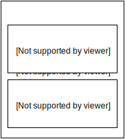

.. _node-types:

==========
Node-types
==========

What is a Node-type
-------------------

A node-type is the blueprint for your node-source.
It will contain all fields that Roadiz will use to generate an extended node-source class.

.. image:: ./NSPage-php.svg
   :align: center

For example, a node-type "Page" will contain "content" and "header image" fields.
The "title" field is always available as it is hard-coded in ``NodesSources`` class.
After saving your node-type, Roadiz generates a ``NSPage`` class which extends the ``NodesSources`` class.
You will find it in the ``gen-src/GeneratedNodeSources``.
Don’t modify the generated class! You’ll have to update it by the backend interface.

Here is a schema to understand how node-types can define custom fields into node-sources:

With Roadiz commands you get several commands to manage node-types.
We really encourage you to check the commands with ``--help`` argument, as following:

.. code-block:: console

    bin/roadiz core:node-types --help

Now let's have a look on node-source.
