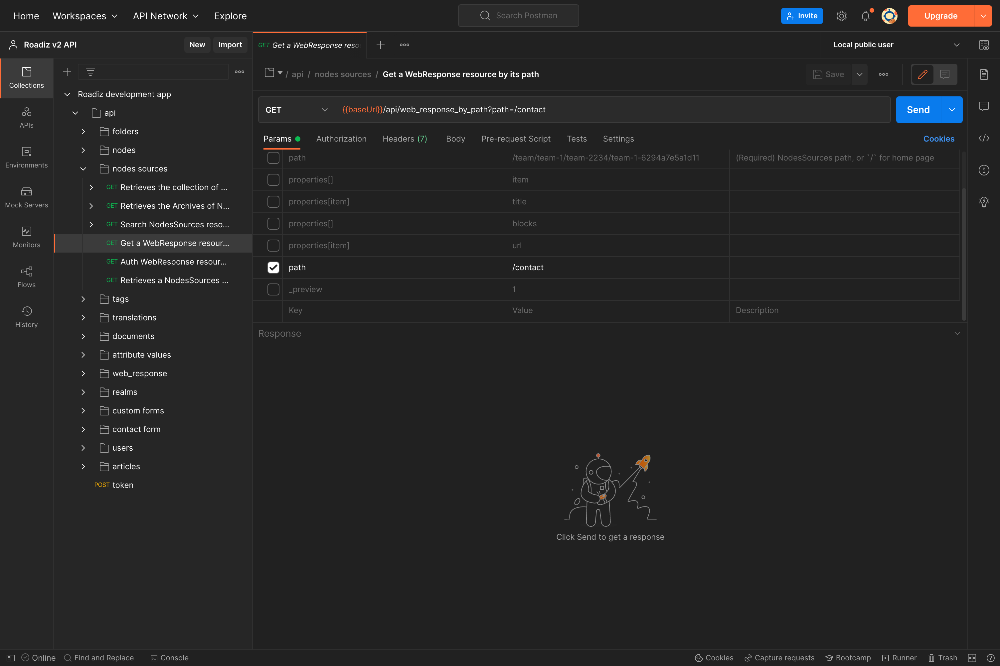

.. _api:

Building headless websites using API
===================================

Since Roadiz v2, headless development is default and is the most powerful way to build reactive websites and
applications. Roadiz is built on `API Platform <https://api-platform.com/>`_, and it exposes all main entities as
API Resources using `DTO (data transfer objects) <https://api-platform.com/docs/core/dto/#using-data-transfer-objects-dtos>`_

    Consuming Roadiz API with Postman application is a great way to explore and test REST calls for your frontend app

.. toctree::
   :maxdepth: 2

   web_response
   exposing_node_types
   extending_serialization
   serialization
