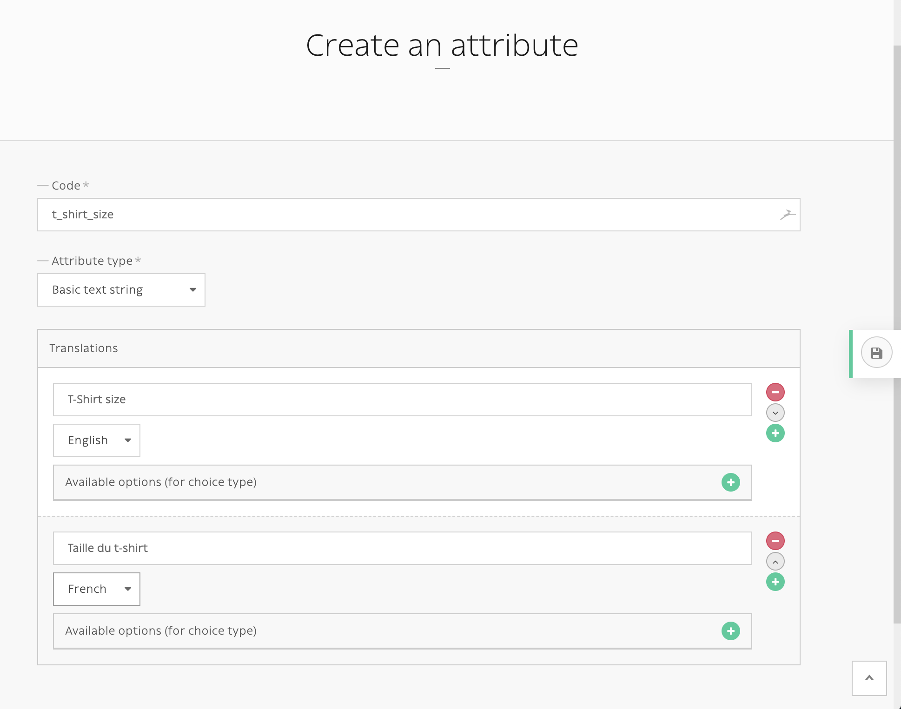

==========
Attributes
==========

Attributes are entities meant to qualify features on other entities, such as *nodes*.
The main difference between *tags* and *attributes* is that you can set a value for
each attributed *node*.

.. image:: ./img/manage_attributes.png
   :align: right
   :width: 300

The attribute "Color" can be set to "red" for one node and set to "green" for an other one.

Okay, but now what is the difference between *attributes* and node-type fields? Not so much
because node-type fields describe your node' features too, but they are fixed and defined by
the developer. Once your node-type fields are created, you have to implement your feature in
your *Twig* templates, and translate it in your XLF files too.

Attributes are meant to be created and added by editors so they can use them in your website lifecycle
without needing any further development.

From the developer perspective, attributes are just a collection of entities to be displayed
in a loop. Then your editor can create new ones and be sure they will be displayed
without any additional development.

.. code-block:: html+jinja

    <ul class="block-attributes">
        
            <li>
                
                    
                        <figure>{{ document|display }}</figure>
                    
                
                <strong>{{ attributeValueTranslation|attribute_label(translation) }}:</strong>
                
                    {{ attributeValueTranslation.value|format_datetime('medium', 'short', locale=app.request.locale) }}
                
                    {{ attributeValueTranslation.value|format_date('medium', locale=app.request.locale) }}
                
                    {{ attributeValueTranslation.value|country_name(request.locale) }}
                
                    {{ attributeValueTranslation.value }}
                
            </li>
        
    </ul>

If you grouped your attributes, you can use ``grouped_attributes`` filter instead:

.. code-block:: html+jinja

    <ul class="block-attributes">
        
            <li>
                
                    <strong>{{ item.group|attribute_group_label(translation) }}</strong>
                
                <ul>
                    
                        <li>
                            
                                
                                    <figure>{{ document|display }}</figure>
                                
                            
                            <strong>{{ attributeValueTranslation|attribute_label(translation) }}:</strong>
                            
                                {{ attributeValueTranslation.value|format_datetime('medium', 'short', locale=app.request.locale) }}
                            
                                {{ attributeValueTranslation.value|format_date('medium', locale=app.request.locale) }}
                            
                                {{ attributeValueTranslation.value|country_name(request.locale) }}
                            
                                {{ attributeValueTranslation.value }}
                            
                        </li>
                    
                </ul>

            </li>
        
    </ul>

Attributes types
^^^^^^^^^^^^^^^^

- *String*
- *Date*
- *Date and time*
- *Single choice*: choice among defined options in your attribute
- *Boolean*
- *Integer*
- *Decimal*
- *Email*
- *Color*
- *Country*: ISO 2-letters country code

Add attributes to nodes
^^^^^^^^^^^^^^^^^^^^^^^

*Attribute* section is available for any node in any translations.

.. image:: ./img/add_attribute.png
   :align: center

Twig extension
^^^^^^^^^^^^^^

Several filters and tests are available to ease up templating with *attributes*:

Filters
-------

- ``attributes``: same as ``node_source_attributes()`` method, get all available attributes from a ``NodesSources``.
- ``grouped_attributes``: same as ``node_source_grouped_attributes()`` method, get all available attributes from a ``NodesSources`` and gather them into their **group**.
- ``attribute_label(translation)``: get attribute translated ``label`` or ``code`` if not translated.
- ``attribute_group_label(translation)``: get attribute group translated ``name`` or ``canonicalName`` if not translated.

Tests
-----

- ``datetime``
- ``date``
- ``country``
- ``boolean``
- ``choice``
- ``enum``

