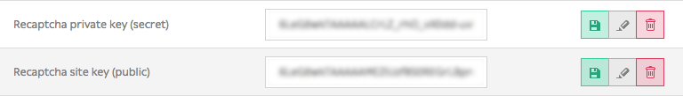

.. _contact-forms:

======================
Building contact forms
======================

With Roadiz you can easily create simple contact forms with ``ContactFormManager`` class. Your controller has
a convenient shortcut to create this manager with ``$this->createContactFormManager()`` method.

If you want to add your own fields, you can use the manager’ form-builder with ``$contactFormManager->getFormBuilder();``.
Then add your field using standard *Symfony* form syntax. Do not forget to use *Constraints* to handle errors.

One contact-form for one action
-------------------------------

Here is an example to create your contact form in your controller action.

.. code-block:: php
   :linenos:

    use Symfony\Component\Validator\Constraints\File;
    use Symfony\Component\Form\Extension\Core\Type\CheckboxType;
    use Symfony\Component\Form\Extension\Core\Type\FileType;
    use Symfony\Component\Form\Extension\Core\Type\SubmitType;

    // …
    // Create contact-form manager and add 3 default fields.
    $contactFormManager = $this->createContactFormManager()
                               ->withDefaultFields();
    /*
     * (Optional) Add custom fields…
     */
    $formBuilder = $contactFormManager->getFormBuilder();
    $formBuilder->add('callMeBack', CheckboxType::class, [
            'label' => 'call.me.back',
            'required' => false,
        ])
        ->add('document', FileType::class, [
            'label' => 'document',
            'required' => false,
            'constraints' => [
                new File([
                    'maxSize' => $contactFormManager->getMaxFileSize(),
                    'mimeTypes' => $contactFormManager->getAllowedMimeTypes(),
                ]),
            ]
        ])
        ->add('send', SubmitType::class, [
            'label' => 'send.contact.form',
        ]);

    /*
     * This is the most important point. handle method will perform form
     * validation and send email.
     *
     * Handle method should return a Response object if everything is OK.
     */
    if (null !== $response = $contactFormManager->handle()) {
        return $response;
    }

    $form = $contactFormManager->getForm();

In this example, we used ``withDefaultFields`` method which add automatically ``email``, ``name`` and ``message``
fields with right validation constraints. This method is optional and you can add any field you want manually, just
keep in mind that you should always ask for an ``email``.

Then in your contact page Twig template:

.. code-block:: html+jinja
   :linenos:

    {#
     # Display contact errors
     #}
    
       
           

               {{- message -}}
           

       
    
    {#
     # Display contact form
     #}
    
    {{ form(contactForm) }}

Using contact-form in *block* controllers
-----------------------------------------

If you want to use *contact-forms* in blocks instead of a full page, you will need
to make your redirection response **bubble** through *Twig* render. The only way to stop
Twig is to **throw an exception** and to pass your Redirect or Json response within your
Exception.

Roadiz makes this possible with ``RZ\Roadiz\CoreBundle\Exception\ForceResponseException``.
For example, in a ``App/Controllers/ContactBlockController``, instead of
returning the ``contactFormManager`` response, you will have to throw a ``ForceResponseException``
with it as an argument.

.. code-block:: php
   :linenos:

    // ./src/Controllers/ContactBlockController.php

    use RZ\Roadiz\CoreBundle\Exception\ForceResponseException;

    …
    // Create contact-form manager and add 3 default fields.
    $contactFormManager = $this->createContactFormManager()
                               ->withDefaultFields();

    if (null !== $response = $contactFormManager->handle()) {
        /*
         * Force response to bubble through Twig rendering process.
         */
        throw new ForceResponseException($response);
    }

    $form = $contactFormManager->getForm();

Then, in your *master* controller (i.e. ``PageController``), ``render`` method will automatically
catch your *ForceResponseException* exception in order to extract the forced response object. Then
it will return your response instead of your page twig rendered output.

Alter email configuration after form submit
-------------------------------------------

If you want to customize emails sent with form data, you can use Symfony form events to change the contact form manager
options:
The following example alters the email subject to add the user email and makes the subject unique for the receiver.

.. code-block:: php

   $formBuilder->addEventListener(FormEvents::SUBMIT, function (FormEvent $event) use ($contactFormManager) {
      $contactFormManager->setSubject($contactFormManager->getSubject() . ': ' . $event->getForm()->get('email')->getData());
   });

You can also use this behaviour to change dynamically the contact form receiver after the user chose it in a select box input.

.. note::

   You can read more about form events at https://symfony.com/doc/current/form/events.html

Securing your form with *Google reCAPTCHA*
------------------------------------------

Roadiz can seamlessly use *Google reCAPTCHA* to secure your contact form against robots.
All you need to do is to register on https://www.google.com/recaptcha/ to ask for a *sitekey*
and a *secret*. Once you’ve got these two keys, add them to your Roadiz settings.

Then, just use ``withGoogleRecaptcha()`` method on your contact-form manager.

.. code-block:: php

    // Create contact-form manager, add 3 default fields and add a reCAPTCHA.
    $contactFormManager = $this->createContactFormManager()
                               ->withDefaultFields()
                               ->withGoogleRecaptcha();

Do not forget to add recaptcha form-template and to embed google’s javascript.

.. code-block:: html

    {# Recaptcha v2 #}
    

.. code-block:: html+jinja

    {# In your theme’ forms.html.twig file #}
    
        {# Recaptcha v2 #}
        

    

.. note::

   Backend logic with Google Recaptcha is compatible with v2 **and** v3. You’ll need to adapt your
   frontend logic.

Sending contact form and accept application/json
------------------------------------------------

If you want to send your contact form using `window.fetch` and `window.FormData`, Roadiz
will still generate an html-based `Response` or `RedirectResponse`. You need to add `Accept: application/json`
header to your request so that Roadiz will respond as JSON. Roadiz `JsonResponse` will contain *success* message or
*error* messages for each wrong fields.
