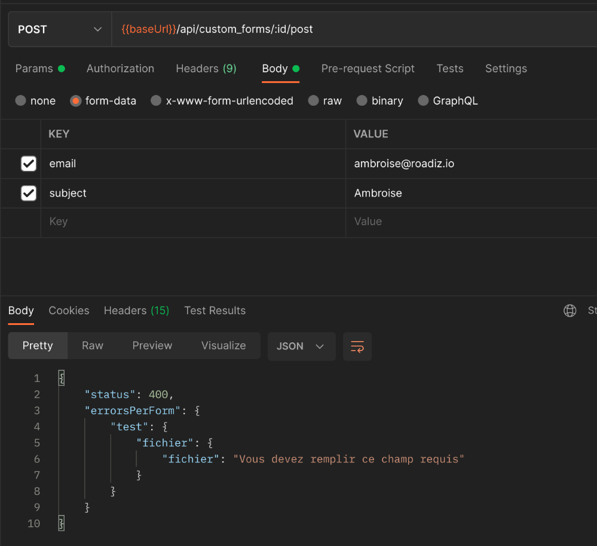
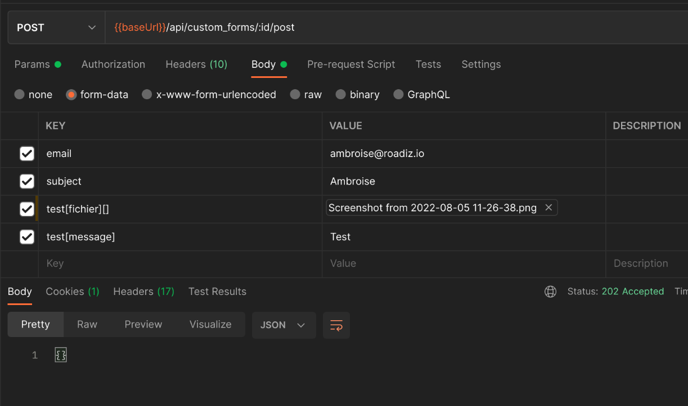
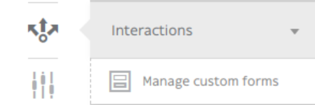
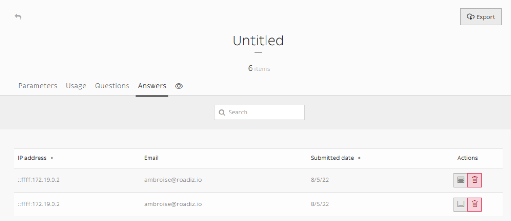
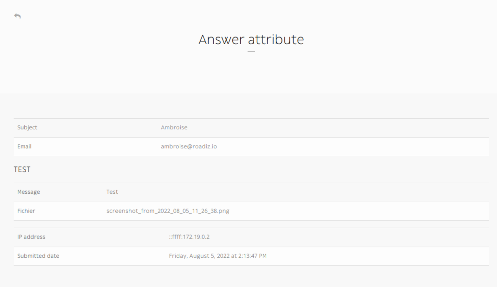

.. _custom-forms:

=====================
Building custom forms
=====================

Building a custom form looks like building a node but it is a lot simpler!
Let's have a look at structure image.

.. image:: ./img/custom-form.*
    :align: center

After creating a custom form, you add some question. The questions are the CustomFormField type.

The answer is saved in two entities:
    - in CustomFormAnswer
    - in CustomFormFieldAttribute

The CustomFormAnswer will store the IP and the submitted time. While question answer will be in CustomFormFieldAttribute with the CustomFormAnswer id and the CustomFormField id.

Exposing a custom form in your API
^^^^^^^^^^^^^^^^^^^^^^^^^^^^^^^^^^

Custom-form can be filled in a headless context, using _definition_ and _post_ endpoints:

.. code-block:: http

   GET {{baseUrl}}/api/custom_forms/:id/definition

Custom form definition is a **JSON form schema** meant to give your frontend application a recipe to build a HTML form:

.. code-block:: json

   {
       "title": "",
       "type": "object",
       "properties": {
           "subject": {
               "type": "string",
               "title": "Subject",
               "attr": {
                   "data-group": null,
                   "placeholder": null
               },
               "description": "Est aut quas eum error architecto.",
               "propertyOrder": 1
           },
           "email": {
               "type": "string",
               "title": "Email",
               "attr": {
                   "data-group": null,
                   "placeholder": null
               },
               "description": "Email address",
               "widget": "email",
               "propertyOrder": 2
           },
           "test": {
               "title": "TEST",
               "type": "object",
               "properties": {
                   "message": {
                       "type": "string",
                       "title": "Message",
                       "attr": {
                           "data-group": "TEST",
                           "placeholder": null
                       },
                       "widget": "textarea",
                       "propertyOrder": 1
                   },
                   "fichier": {
                       "type": "string",
                       "title": "File",
                       "attr": {
                           "data-group": "TEST",
                           "placeholder": null
                       },
                       "widget": "file",
                       "propertyOrder": 2
                   }
               },
               "required": [
                   "fichier"
               ],
               "attr": {
                   "data-group-wrapper": "test"
               },
               "propertyOrder": 3
           }
       },
       "required": [
           "subject",
           "email",
           "test"
       ]
   }

Then you can send your data to the **post** endpoint using *FormData* and respecting field hierarchy:

.. code-block:: http

   POST {{baseUrl}}/api/custom_forms/:id/post

If there are any error, a *JSON* response will give you details fields-by-fields.

If post is successful, APi will respond an empty ``202 Accepted`` response

Then you will be able to see all your form submits in Roadiz backoffice :

In Manage custom forms section / Answers

.. note:: Any file attached to your custom-form answers will be uploaded as private documents.

Adding custom form to your theme
^^^^^^^^^^^^^^^^^^^^^^^^^^^^^^^^

If you want to integrate your custom-forms into your theme, you can use Roadiz
``CustomFormHelper`` class to generate a standard ``FormInterface`` and to
create a view into your theme templates.

First you must create a dedicated action for your node or your block
if you used ``{{ nodeSource|render(@AwesomeTheme) }}`` Twig filter.

.. code-block:: php
   :linenos:

    use RZ\Roadiz\CoreBundle\Entity\CustomForm;
    use RZ\Roadiz\CoreBundle\Exception\EntityAlreadyExistsException;
    use RZ\Roadiz\CoreBundle\Exception\ForceResponseException;
    use Symfony\Cmf\Component\Routing\RouteObjectInterface;
    use RZ\Roadiz\CoreBundle\CustomForm\CustomFormHelper;
    use Symfony\Component\Form\FormError;
    use Symfony\Component\HttpFoundation\JsonResponse;

    // …

    /*
     * Get your custom form instance from your node-source
     * only if you added a *custom_form reference field*.
     */
    $customForms = $this->nodeSource->getCustomFormReference();
    if (isset($customForms[0]) && $customForms[0] instanceof CustomForm) {
        /** @var CustomForm $customForm */
        $customForm = $customForms[0];

        /*
         * Verify if custom form is still open
         * for answers
         */
        if ($customForm->isFormStillOpen()) {
            /*
             * CustomFormHelper will generate Symfony form against
             * Roadiz custom form entity.
             * You can add a Google Recaptcha passing following options.
             */
            $helper = $this->customFormHelperFactory->createHelper($customForm);
            $form = $helper->getForm($request, false, true);
            $form->handleRequest($request);

            if ($form->isSubmitted() && $form->isValid()) {
                try {
                    $answer = $helper->parseAnswerFormData($form, null, $request->getClientIp());

                    if ($request->isXmlHttpRequest()) {
                        $response = new JsonResponse([
                            'message' => $this->getTranslator()->trans('form_has_been_successfully_sent')
                        ]);
                    } else {
                        $this->publishConfirmMessage(
                            $request,
                            $this->getTranslator()->trans('form_has_been_successfully_sent')
                        );
                        $response = $this->redirect($this->generateUrl(
                            RouteObjectInterface::OBJECT_BASED_ROUTE_NAME,
                            [RouteObjectInterface::ROUTE_OBJECT => $this->nodeSource->getParent()]
                        ));
                    }
                    /*
                     * If you are in a BlockController use ForceResponseException
                     */
                    throw new ForceResponseException($response);
                    /*
                     * Or directly return redirect response.
                     */
                    //return $response;
                } catch (EntityAlreadyExistsException $e) {
                    $form->addError(new FormError($e->getMessage()));
                }
            }

            $this->assignation['form'] = $form->createView();
        }
    }

If you didn’t do it yet, create a custom form theme in your ``views/`` folder:

.. code-block:: html+jinja
   :linenos:

    {#
     # AwesomeTheme/Resources/views/form.html.twig
     #}
    

    
        

            
                {{- form_label(form) -}}
            
            {{- form_errors(form) -}}
            {#
             # Render field description inside your form
             #}
            
                

                    {{ form.vars.attr['data-description']|markdown }}
                

            
            {{- form_widget(form) -}}
        

    

    
       <input id="my-form-recaptcha" type="hidden" name="{{ form.vars.name }}" />
       
       
   

In your main view, add your form and use your custom form theme:

.. code-block:: html+jinja
   :linenos:

    {#
     # AwesomeTheme/Resources/views/form-blocks/customformblock.html.twig
     #}
    
        
        {{ form_start(form) }}
        {{ form_widget(form) }}
        

            <button class="btn btn-primary" type="submit">send_form</button>
        

        {{ form_end(form) }}
    
        
form_is_not_available

    
