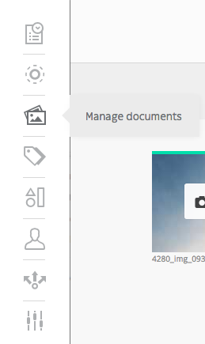
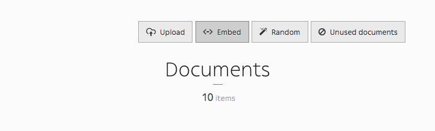
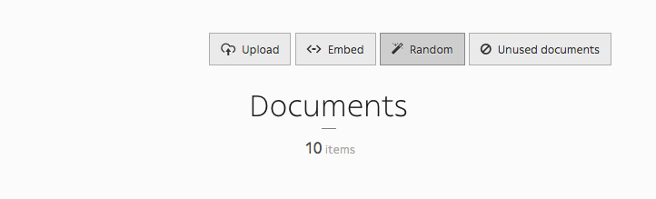

.. _managing_documents:

Managing documents
==================

You can manage documents via the *Document* icon in the toolbar. You can either upload, embed, randomly downloaded documents, and even have a look at unused documents in your website.

Upload document
---------------

Uploading a document has never been this easy: just drag and drop the document in the designated area.

.. image:: ./img/upload_document.png
    :align: center

When you upload files, Roadiz will try to reduce any image larger than 2500 pixels (width or height) in order to ease up further transformations on it. The CMS will always keep a *raw* version of your uploaded document if you decide to increase this limit over 2500 pixels.
Keep in mind that Roadiz won’t be able to optimize your image to a better format: for example if you uploaded a PNG image containing no transparent area, the CMS won’t convert it to JPEG format and you will end up with a heavy file even if you resize it.

- Photographs, complex images with no transparency: *use JPEG*
- Logos, icons, complex images with transparency: *use PNG*

Using an image optimizer (such as *tinyjpg*, *kraken.io*, *jpgoptim*, …) **before** uploading onto Roadiz is useless because, the CMS will lose these optimizations when it processes transformations (crop, resizing, contrast and quality).

On the other hand, if your website has been developed with ``picture`` support, Roadiz will be able to serve any images in the new WEBP format which is 30% lighter than JPEG and supports transparency (alpha channel). So any user browsing your website with a Chrome, Firefox or Edge will see only WEBP images and will save up minimum 30% of bandwidth usage.
In the near future, AVIF image format will be more supported by major browsers, and Roadiz will be able to generate optimized image with this format too.

Embed document
--------------

Here is the magical part of the Documents section. You can have embedded documents from *YouTube*, *SoundCloud*, *Vimeo*, *Mixcloud*, *Spotify*, *Twitch*, *TED* and *Dailymotion*, then use them as if they were images in your content blocks.

Random document
---------------

*Random* is a cool feature that allows to download random documents to your website from *Splashbase*.

Unused document
---------------

Clicking *Unused document* allows you to gather every unused documents on your website, so you can clean your database and get rid of useless documents.

.. image:: ./img/unused_document.png
    :align: center