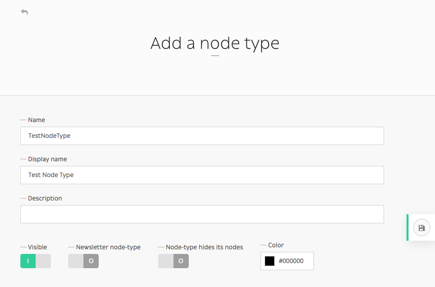
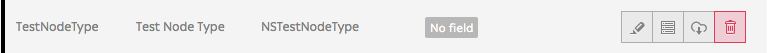
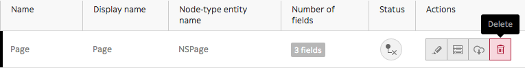
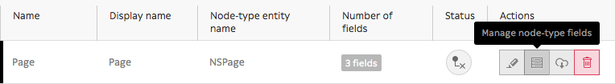

.. _managing_node_types:

Managing node-types
===================

This is a simple guide on how to create and manage nodes using Roadiz CLI, add and remove node fields, or even how to import nodes.

First and foremost, you need to create a new node-type before creating any kind of node.

If you want to know more about what a node-type is, please visit the other section of the developer documentation.

When working with Roadiz in the back-office, you can easily manage node-types via the *Construction* icon in the toolbar.

.. image:: ./img/manage_nodetype_toolbar.png
    :align: center

Add node-type
-------------

Once you have landed on the Node-Types page (*https://mywebsite.com/rz-admin/node-types*), you can create node-types by clicking on *Add a node-type*.

.. note ::
    You can export and import a node-type if you have a .json file. See *Other action* for more information.

.. image:: ./img/create_nodetype_button.png
    :align: center

Upon filling the two mandatory settings *Name* (that developpers will use) and *Display Name* (that back-office users will see), you are now ready to create your first node type.

.. warning ::
    Be careful when you name your node-type though, *Name* field can't be changed once the node-type is created. See *Delete node-type* section to know how to delete a node-type.

Other options (*Visible*, *Newsletter node-type*, *Node-type hides its nodes* and customizable color) aren't required and can always be altered later on.

You have now created your first node-type! It now appears on the node-type page along other node-types and you can now manage its fields.

Delete node-type
----------------

Made a typo when creating a node-type? No longer in need of a node-type ? You can delete it by simply clicking the trashcan icon on the Node Types page (*https://mywebsite.com/rz-admin/node-types*).

Adding node-type field
----------------------

To add fields to your newly-created node-type, click the *Manage node-type fields* icon.

Then click on 'Add a node-type field' button.

.. image:: ./img/add_nodetype_field_menu.png
    :align: center

Fill in the form to create a new field :

- *Name*: what developers will use
- *Label*: what back-office users will see
- *Type*: single choice option that will define the content (basic text, markdown text, documents, email, number, single or multiple choice, children nodes etc.)
- *Description*, *Group name*, *Visible*, *Indexed*, *Default values*, *Min length*, *Max length* (optional)

.. note ::
    *Default values* is an interesting field as you can specify what kind of node-types that can be linked to this node-type. You can also use it as a filter in the explorer, and only show those default values.

.. image:: ./img/add_nodetype_field.png
    :align: center

Other actions
-------------

From one website to another, you can export node-types as .json files.

.. image:: ./img/export_nodetype.png
    :align: center

An .json file should look like this when you open it in any editor:

.. code-block:: json

    {
        "name": "Page",
        "displayName": "Page",
        "visible": true,
        "publishable": false,
        "reachable": true,
        "newsletterType": false,
        "hidingNodes": false,
        "color": "#000000",
        "fields": [
            {
                "position": 1.0,
                "name": "content",
                "label": "Content",
                "type": 4,
                "expanded": false,
                "nodeTypeName": "Page",
                "universal": false,
                "indexed": false,
                "visible": true
            },
            {
                "position": 2.0,
                "name": "children",
                "label": "N\u0153uds enfants",
                "type": 16,
                "expanded": false,
                "nodeTypeName": "Page",
                "universal": false,
                "indexed": false,
                "visible": true
            },
            {
                "position": 3.0,
                "name": "header_image",
                "label": "Header image",
                "type": 9,
                "expanded": false,
                "nodeTypeName": "Page",
                "universal": false,
                "indexed": false,
                "visible": true
            },
            {
                "position": 4.0,
                "name": "pictures",
                "label": "Pictures",
                "type": 9,
                "expanded": false,
                "nodeTypeName": "Page",
                "universal": false,
                "indexed": false,
                "visible": true
            }
        ],
        "defaultTtl": 0
    }

Notice the four fields that have been added to this *Page* node-type.

You can write an .json file yourself if you feel like it, but it is probably easier to simply export node-types from existing website, then import it on your new website.
It can be easily done by clicking on *Import node-type* button, then selecting it via your explorer.

.. image:: ./img/import_nodetype.png
    :align: center

You are close to fully master Roadiz' back-office powers ! Keep refering to this documention if you have any problem, and let us know if any information goes missing.
