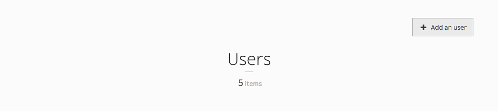
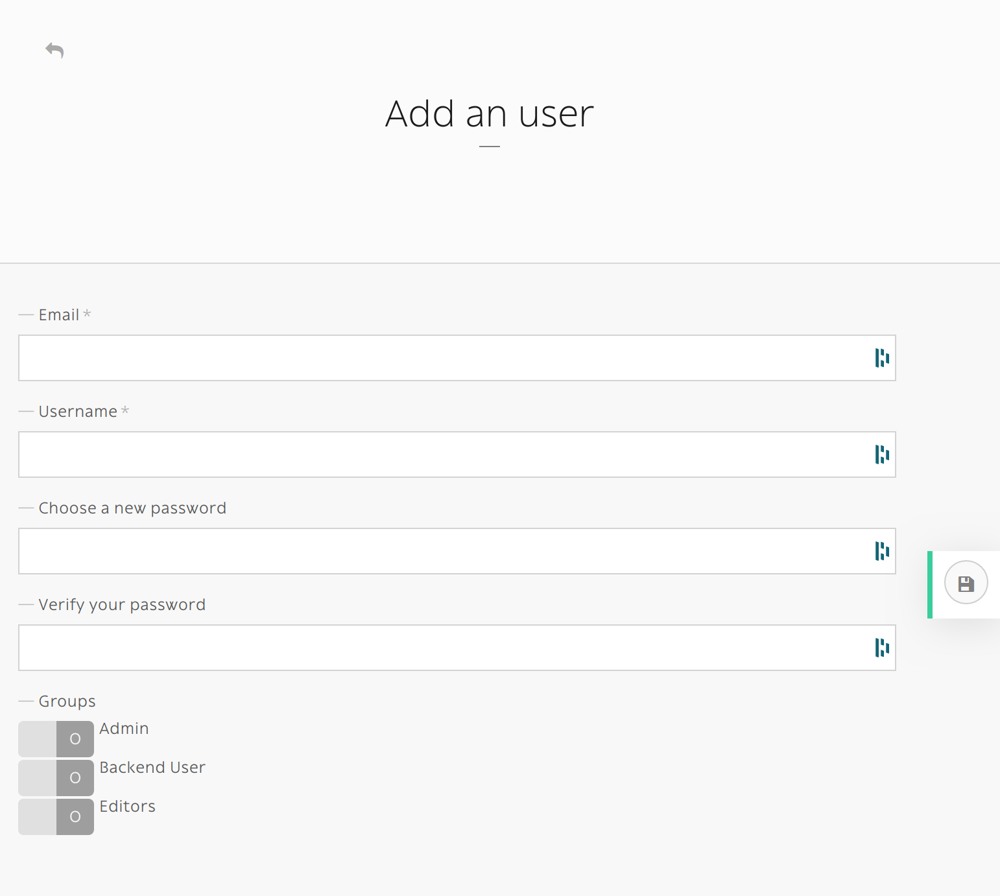
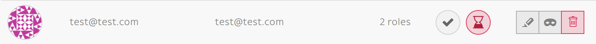
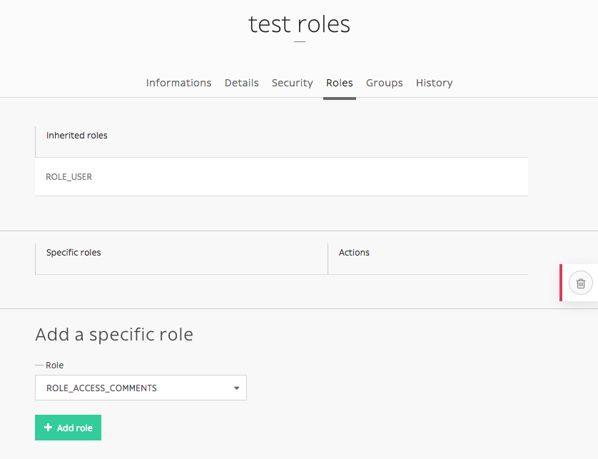
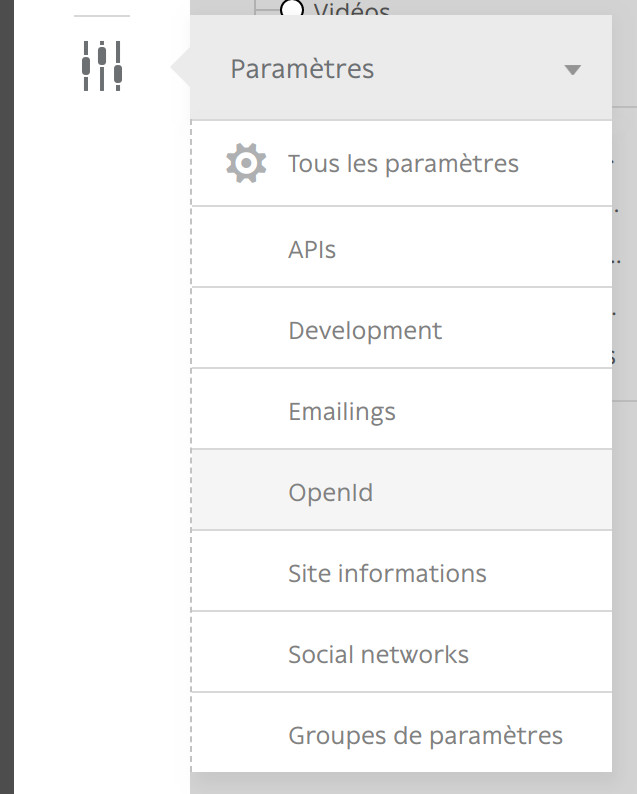
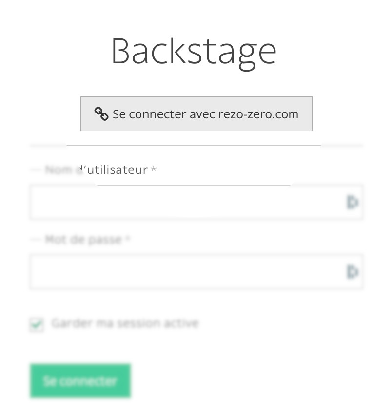

.. _managing_users:

Managing users
==============

This is a simple guide on how to create and manage users using Roadiz CLI.

There are two ways of adding users, via the back-office and in command-line, both will be displayed in each section.

When working with Roadiz in the back-office, you can easily manage users via the *User system* icon in the toolbar.

.. image:: ./img/add_user_toolbar.png
    :align: center

Create a new user
-----------------

You can add users simply by clicking *Add an user* button.

If you create an user without specifying its *password*, an email with a password reset link will sent.
Make sure that you entered the right email and that your Roadiz website has a *mailer* configured. New user will be locked
unless he or she resets its password first.

    A new user without password will stay locked until he or she resets its password.

The command-line ``bin/console users:create loginname`` starts a new interactive user creation session.
You will create a new user with login and email, you can also choose if it's a backend user and if it's a superadmin.

Delete user
-----------

You can remove users by clicking the trashcan icon.

.. image:: ./img/remove_user.png
    :align: center

The command ``bin/console users:delete loginname`` delete the user "loginname".

Adding role
-----------

You can edit a users profile the same way you edit a node-type. You can add roles in the *Roles* tab.

If you want to add ``ROLE_SUPERADMIN`` role to "test" user, it would look like this in command-line:

.. code-block:: console

    bin/console users:roles --add loginname
    # You will be prompted to choose the ROLE with auto-complete feature.

Other action
------------

It is possible to enable or disable users with ``users:enable`` or ``users:disable`` command.
If a user doesn't remember his password, you can regenerate it with the ``users:password`` command.
For more information and more actions, we invite you to check available commands with:

.. code-block:: console

    bin/console list users

Enable SSO for back-office users
--------------------------------

Roadiz is compatible with any **OpenID** single sign-on system (such as Google, Exchange, …) and can
be configured to allow your company users to login to your back-office with several ``ROLES``.

First, make sure to generate and gather the following information from your *OpenID* provider:

- OpenID client ID
- OpenID client secret
- OpenID auto-discovery URL (i.e. for Google GSuite user https://accounts.google.com/.well-known/openid-configuration)

Then you should decide:

- What *roles* (comma separated) you want to be automatically granted to users connected with your SSO.
- What domain name to restrict users from. This is very important for *Google Suite* users because the auto-discovery is the same for everybody. You may not want to allow every Google Suite users to access your back-office 😉.
- A button label for your back-office login page.

.. code-block:: yaml

    # config/packages/roadiz_rozier.yaml
    roadiz_rozier:
        open_id:
            # Verify User info in JWT at each login
            verify_user_info: false
            # Standard OpenID autodiscovery URL, required to enable OpenId login in Roadiz CMS.
            discovery_url: '%env(string:OPEN_ID_DISCOVERY_URL)%'
            # For public identity providers (such as Google), restrict users emails by their domain.
            hosted_domain: '%env(string:OPEN_ID_HOSTED_DOMAIN)%'
            # OpenID identity provider OAuth2 client ID
            oauth_client_id: '%env(string:OPEN_ID_CLIENT_ID)%'
            # OpenID identity provider OAuth2 client secret
            oauth_client_secret: '%env(string:OPEN_ID_CLIENT_SECRET)%'
            granted_roles:
                - ROLE_USER
                - ROLE_BACKEND_USER
                - ROLE_SUPERADMIN

Fill all your gathered information to the right *Roadiz* dotenv variables.

.. code-block:: dotenv

    OPEN_ID_DISCOVERY_URL=https://accounts.google.com/.well-known/openid-configuration
    OPEN_ID_HOSTED_DOMAIN=my-google-workspace-domain.com
    OPEN_ID_CLIENT_ID=xxxxxxx
    OPEN_ID_CLIENT_SECRET=xxxxxxx

Then, if your parameter are correct you should see your SSO connect button on *Roadiz* back-office login page.
Pay attention that if your SSO users do not have sufficient permissions they may have a 403 error after being redirected
from SSO flow.

.. note::

    Google Suite OpenID implementation is described at https://developers.google.com/identity/protocols/oauth2/openid-connect#discovery

    First, create a new OAuth2 application on https://console.cloud.google.com/ and follow instructions at https://developers.google.com/identity/protocols/oauth2/openid-connect#getcredentials
