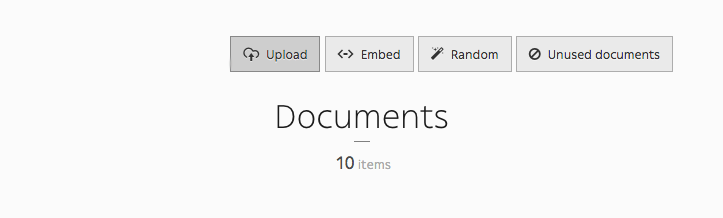
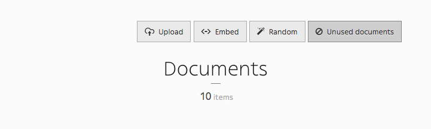

.. _managing_documents:

Managing documents
==================

You can manage documents via the 'Document' icon in the toolbar. You can either upload , embed, randomize documents, and even have a look at unused documents in your website.

.. image:: ./img/toolbar_document.png
    :align: center

Upload document
---------------

Uploading a document has never been this easy : just drag and drop the document in the designated area.

Embed document
--------------

Here is the trickiest part of the Documents section. You can have embedded documents from Youtube, SoundCloud, Vimeo and Dailymotion.

.. image:: ./img/embed_document.png
    :align: center

.. warning ::
    You may need to have a look at `Youtube <https://developers.google.com/youtube/v3/>`_'s and `SoundCloud <https://developers.soundcloud.com/docs>`_'s documentation, as you need an access token to have embedded documents from both of them.

Random document
---------------

'Random' is a cool feature that allows to upload random documents to your website from Splashbase. It uses REST API and it works pretty well.

.. image:: ./img/random_document.png
    :align: center

Unused document
---------------

Clicking 'Unused document' allows you to gather every unused documents on your website, so you can clean your database and get rid of useless documents.

