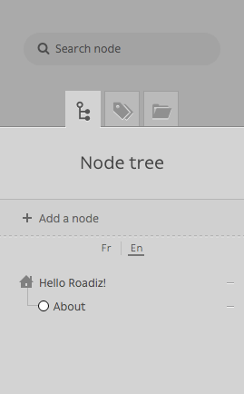
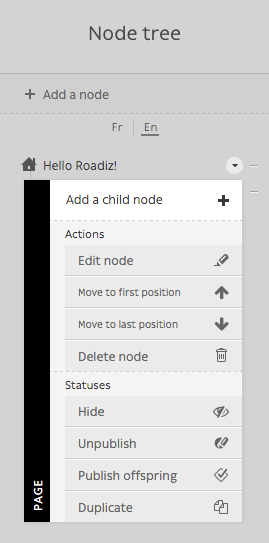
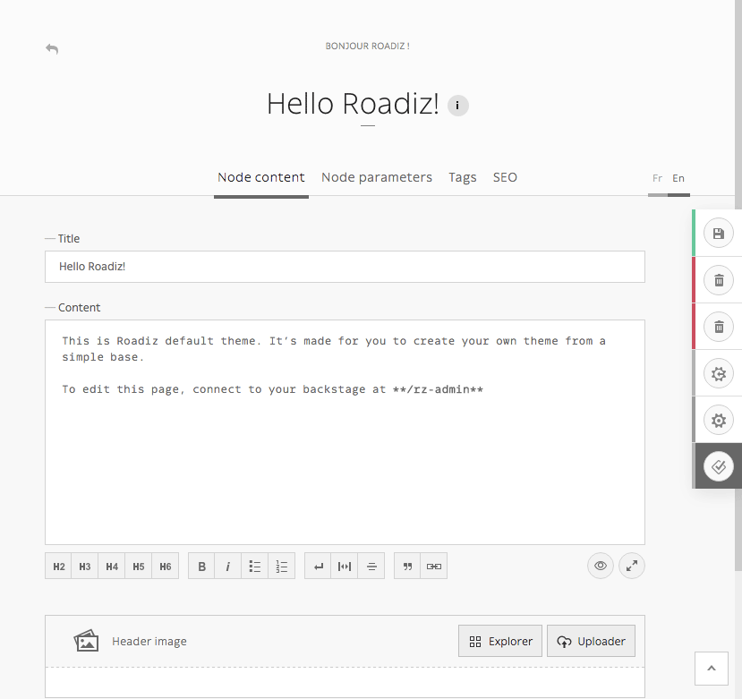

.. _managing_nodes:

Managing nodes
==============

Nodes are the most important part of Roadiz CMS. They are your content which can
be shaped as you want according to your node-types definitions.
A node can be a blog-post, a content page, a photo gallery, even a shop product.
This is why we called it “Node”, it’s an abstract data container interconnected with
other node in a tree.

Node-tree navigation
--------------------

Each node has a place in your website, that’s why we chose to arrange your content
in a tree-shaped way. It’s intuitive and it works the same as your computer files.

- To edit a node’ content, simply click on it.
- To move a node across your tree, drag & drop using its handle (round or rombus shape). You can drop a node after or before an other one. You can also drop inside just by moving your mouse a bit on the right, you should see the node shadow to shift right.
- Other actions are available from each node’ contextual menu. Right click on the node or click on the arrow at the right when you pass your mouse over.

.. container:: clearer

Creating a node
---------------

.. sidebar:: Add buttons

    .. image:: ./img/add-node-btn.gif
        :align: center

    “Add node” button located at the top of your *node-tree*.

    .. image:: ./img/add-child-node-btn.gif
        :align: center

    “Add a *child* node” button, which is located at the top of each node’ contextual menu.

To add a blank node to your node-tree, you will need to choose your location. In Roadiz
you can add a content at the root of your tree or choose a “parent-node”. In both cases
you will be asked to choose a *node-type* and a *node-name* before creating your node.

- *Node name* is the global identifier for your node. It must be unique and won’t change from one translation to an other. It can be changed later except if your developer locked it up. *Node name* is usually used to build your pages URL.
- *Node-type* defines what fields will be available in your content. Choose well as you won’t be able to change it later, you ’ll have to delete and recreate an other node.

Edit an existing node
---------------------

Node edition page is composed in several tabs.

- Node content
- Node parameters
- Tags
- SEO
- Tree, if your node is set up as a *container*

Node content
^^^^^^^^^^^^

Contents tab is basically the main part where you will edit your node specific data,
using node-type fields such as *text* fields, or *documents* fields, etc.

*This tab will display different content over translations.*

Node parameters
^^^^^^^^^^^^^^^

Parameters are global data such as your *node name*. They are used for managing your node
visibility according to each user role and node back-office’ settings. This section should
not be used so often as parameters will be set once by your developer.

*This tab will display the same content over translations.*

Tags
^^^^

*This tab will display the same content over translations.*

SEO
^^^

*This tab will display different content over translations.*

Tree
^^^^
