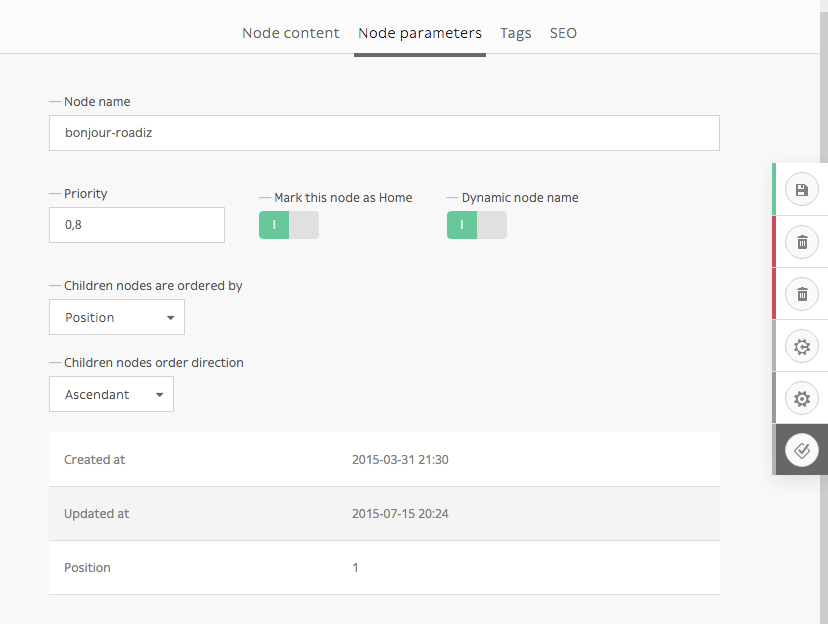
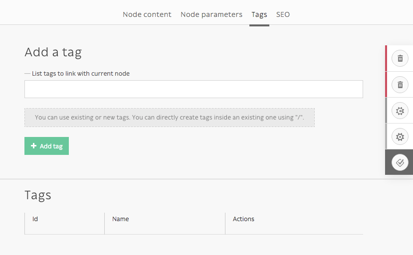
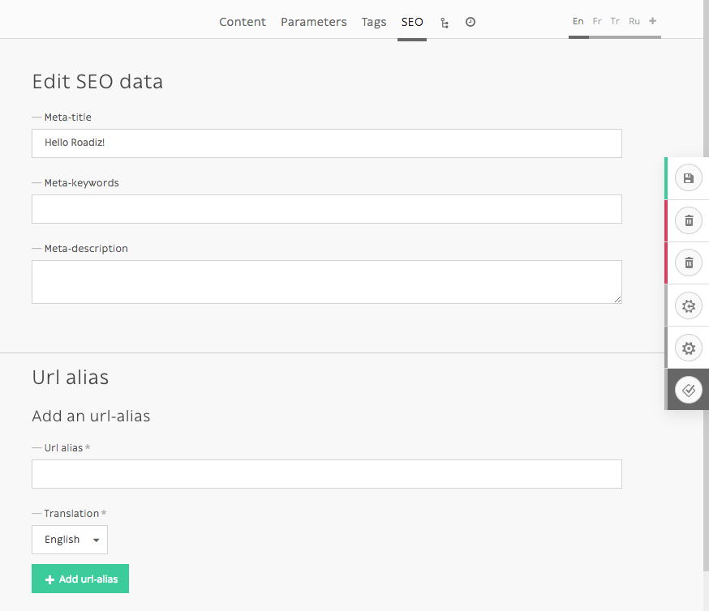
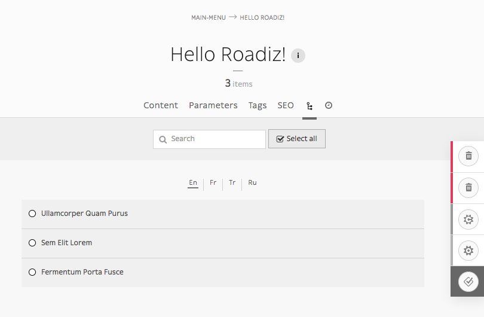
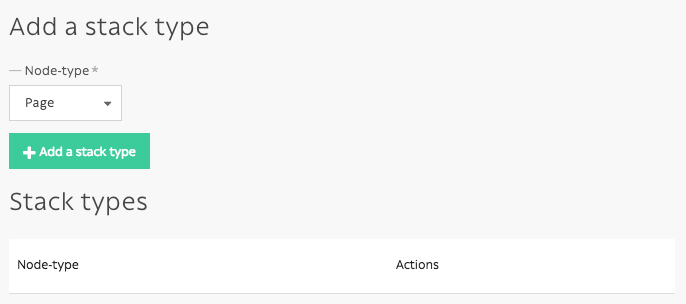
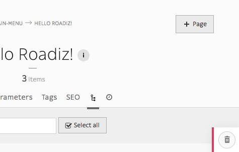

.. _managing_nodes:

Managing nodes
==============

Nodes are the most important part of Roadiz CMS. They are your content which can
be shaped as you want according to your node-types definitions.
A node can be a blog-post, a content page, a photo gallery, even a shop product.
This is why we called it “Node”, it’s an abstract data container interconnected with
other node in a tree.

Node-tree navigation
--------------------

.. sidebar:: Node tree

    Simple node-tree after installing Roadiz with *Default theme*.

    .. image:: ./img/node-tree.png
        :align: center

    Contextual menu for *home* node.

    .. image:: ./img/node-tree-contextual.png
        :align: center

Each node has a place in your website, that’s why we chose to arrange your content
in a tree-shaped way. It’s intuitive and it works the same as your computer files.

- To edit a node’ content, simply click on it.
- To move a node across your tree, drag & drop using its handle (round or rombus shape). You can drop a node after or before an other one. You can also drop inside just by moving your mouse a bit on the right, you should see the node shadow to shift right.
- Other actions are available from each node’ contextual menu. Right click on the node or click on the arrow at the right when you pass your mouse over.

Contextual menu actions
^^^^^^^^^^^^^^^^^^^^^^^

- *Add child node:* to create a content inside the current node.
- *Edit node:* links to the current node “edit content” page.
- *Move to first position:* to move a node at the first position inside its parent node.
- *Move to last position:* basically the same for the last position.
- *Delete node:* to move current node to the trashcan. A confirmation page will be prompt before really deleting a node.
- *Hide/Show:* Change a node’ visibility. A hidden node won’t be displayed in Urls and your website, even if you are an administrator.
- *Publish/Unpublish:* Change a node’ publication status. Unpublished nodes aren’t visible to anonymous visitors, but visible for back-office users using ``preview.php`` entry point.
- *Publish offspring:* Publish a node and all its children nodes recursively.
- *Duplicate:* Copy all current node’ content and relationships into a new node.

Creating a node
---------------

.. sidebar:: Add buttons

    .. image:: ./img/add-node-btn.png
        :align: center

    “Add node” button located at the top of your *node-tree*.

    .. image:: ./img/add-child-node-btn.png
        :align: center

    “Add a *child* node” button, which is located at the top of each node’ contextual menu.

To add a blank node to your node-tree, you will need to choose your location. In Roadiz
you can add a content at the root of your tree or choose a “parent-node”. In both cases
you will be asked to choose a *node-type* and a *node-name* before creating your node.

- *Node name* is the global identifier for your node. It must be unique and won’t change from one translation to an other. It can be changed later except if your developer locked it up. *Node name* is usually used to build your pages URL.
- *Node-type* defines what fields will be available in your content. Choose well as you won’t be able to change it later, you ’ll have to delete and recreate an other node.

Edit an existing node
---------------------

Node edition page is composed in several tabs.

- :ref:`Node content <node-content-tab>`
- :ref:`Node parameters <node-parameters-tab>`
- :ref:`Tags <node-tags-tab>`
- :ref:`SEO <node-seo-tab>`
- :ref:`Tree <node-tree-tab>`, if your node is set up as a :ref:`stack <side-actions-parameters>`

.. _node-content-tab:

Node content
^^^^^^^^^^^^

Contents tab is basically the main part where you will edit your node specific data,
using node-type fields such as *text* fields, or *documents* fields, etc.

This tab will display different content over translations depending on which fields are marked as *universal* or not.

.. _node-parameters-tab:

Node parameters
^^^^^^^^^^^^^^^

Parameters are global data such as your *node name*. They are used for managing your node
visibility according to each user role and node back-office’ settings. This section should
not be used so often as parameters will be set once by your developer.

*This tab will display the same content over translations.*

.. _side-actions-parameters:

Side actions and parameters
^^^^^^^^^^^^^^^^^^^^^^^^^^^

Additional parameters are available on the right action-menu. These parameters are
node-wide, they will apply on each node translations.

.. image:: ./img/node-parameters-panel.png
    :align: center

- **Visibility**: Hide or show current node (according to your theme)
- **Hide children**: Switch current node to a **stack**, children nodes won’t appear in the global Node-Tree anymore. You will be able to add *Stack type* buttons in the :ref:`node parameters tab <node-parameters-tab>`.
- **Lock status**: Prevent users to delete current node or rename it. You should switch it on if your rely on some nodes in your themes.
- **Forbid children**: Prevent users to create children nodes.

.. _node-tags-tab:

Tags
^^^^

*This tab will display the same content over translations.*

.. _node-seo-tab:

SEO
^^^

*This tab will display different content over translations.*

.. _node-tree-tab:

Tree
^^^^

When a node is defined as a :ref:`stack <side-actions-parameters>`, *Tree* becomes its default view. You can set the
default ordering in the *Edit tab*. And node-types set as *publishable* will display their publication date before its name.

Tree view becomes very interesting if you have many many children nodes, when you have blog posts
or portfolio projects for example. 

Then you can add *stack type* in *Edit tab* to make some handy 
quick-add buttons to this view.

Nodes publication system
------------------------

During its lifecycle, every nodes can have a different publication status.
When you create a new content, it will be automatically set as **Draft** by Roadiz so that
you can edit it without bothering your visitors and sharing unfinished work.

Available statuses:
^^^^^^^^^^^^^^^^^^^

- **Draft**: First status for new nodes
- **Pending validation**: It’s a medium status for user that do not have permission to publish nodes
- **Published**: That’s the most important status, it will set the green light to your visitor to view your content
- **Archived**: When you don’t want to publish a node but you don’t want to delete it either
- **Deleted**: It’s the last status for your nodes. Before emptying your node trashcan, every content will wait with this status.

To improve status visibility, *draft* and *pending* nodes have a rhombus shape and *published* nodes have a circle shape.

Preview unpublished nodes
^^^^^^^^^^^^^^^^^^^^^^^^^

As unpublished nodes are not viewable for anonymous visitors, Roadiz allows backend users to preview them
using a dedicated *entry point* called ``preview.php``, yes this is not very original. We decided to create
a different entry point not to share the same URL with your public website as it could create confusing errors if your
website is hosted behing a reverse proxy engine.

For example, if your ``my-news`` page is not published yet, connecting to ``http://mywebsite.com/my-news`` will lead
to a 404 page for your anonymous visitors, as well as you too. If you want to preview it, you’ll have to connect to
``http://mywebsite.com/preview.php/my-news``. This URL will only allow authentified backend users, other people will
be blocked.

