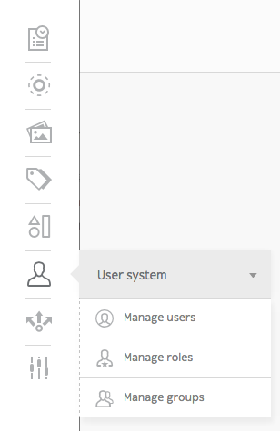
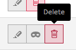

.. _managing_users:

Managing users
==============

This is a simple guide on how to create and manage users using Roadiz CLI.

There are two ways of adding users, via the back-office and in command-line, both will be displayed in each section.

When working with Roadiz in the back-office, you can easily manage users via the *User system* icon in the toolbar.

Add user
--------

You can add users simply by clicking *Add an user* button.

.. image:: ./img/add_user_button.png
    :align: center

The command-line ``bin/roadiz  core:users --create loginname`` starts a new interactive user creation session.
You will create a new user with login and email, you can also choose if it's a backend user and if it's a superadmin.

Delete user
-----------

You can remove users by clicking the trashcan icon.

The command ``bin/roadiz  core:users --delete loginname`` delete the user "loginname".

Adding role
-----------

You can edit a users profile the same way you edit a node-type. You can add roles in the *Roles* tab.

.. image:: ./img/add_role_user.png
    :align: center

If you want to add ``ROLE_SUPERADMIN`` role to "test" user, it would look like this in command-line:

.. code-block:: console

    bin/roadiz  core:users test --add-roles ROLE_SUPERADMIN

You can add multiple roles at the same time, you just need to use a comma separator without space.

Other action
------------

It is possible to enable or disable users with ``--enable`` or ``--disable`` argument.
If a user doesn't remember his password, you can regenerate it with the ``--regenerate`` argument.

For more informations and more actions, we invite you to use the command:

.. code-block:: console

    bin/roadiz  core:users --help
